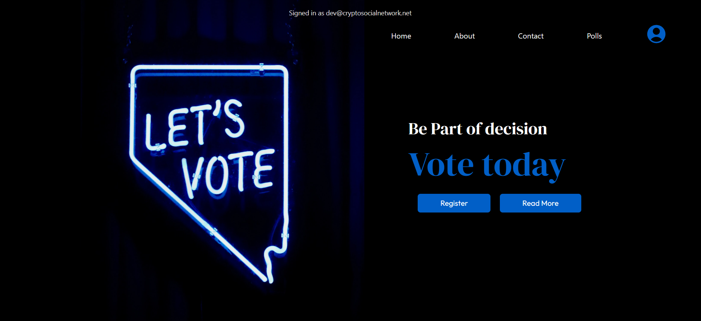

# Voty App



## Table of Contents

- [Introduction](#Introduction)
- [Installation](#Installation)
- [Technologies](#Technologies)
- [License](#license)
- [Author](#author)

## Introduction

simple voting app built using next.js as backend and frontend, the app provides easy way to make votes and vote for polls

## Installation

to be able to run the project you need make .env file with some specifiec keys and make values for them
```
MONGODB_PRISMA_URL=<MONGODB_URL>
NEXTAUTH_SECRET=<NEXT_AUTH_SECRET>
NEXTAUTH_URL=<NEXT_AUTH_URL>
```

after adding the .env file remain the step of installing scripts to build the project file

```
npm run build
```

then run start command to be able to start the web server

```
npm run start
```

## Technologies

- Next.js  (backend + frontend)
- Mongodb  (database)
- Prisma   (ORM Model for node.js)
- tailwind (CSS Library)
- NextAuth (Authentication System)

## Authors

+ Ammar Massoud <ammarmohamedthez@gmail.com>

## License

MIT
